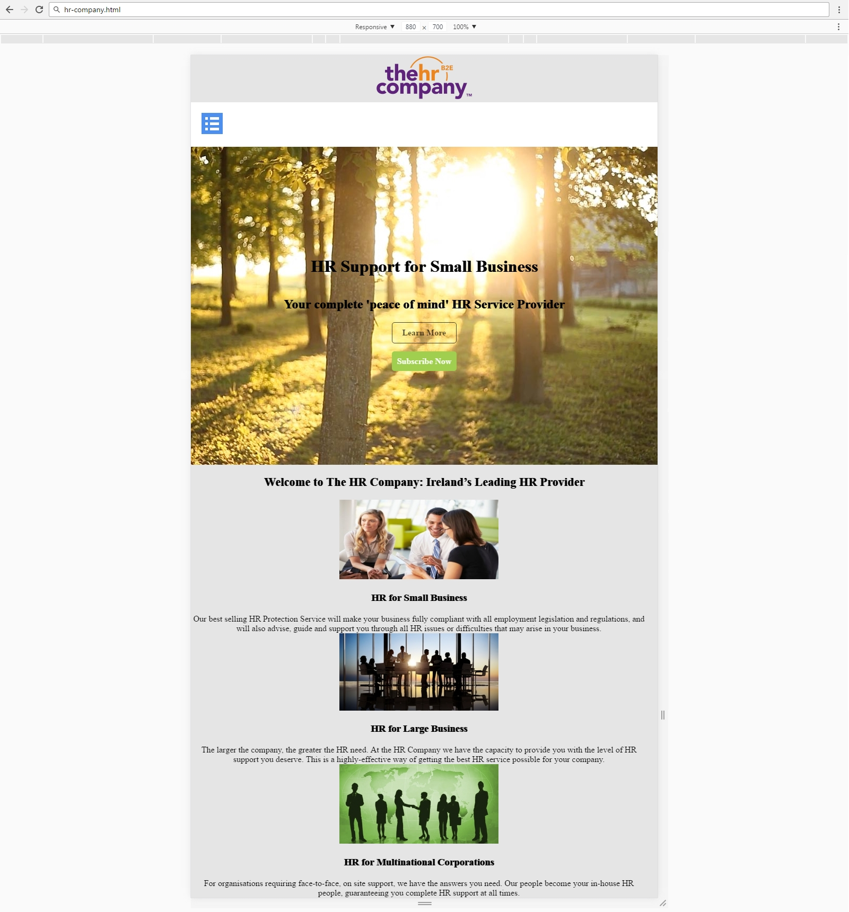

# Hr-Company
You are given an unresponsive Web site (HTML + CSS + images). Your task is to make the site responsive. The site layout should change according to the browser viewport / screen size at 880px. 
 

